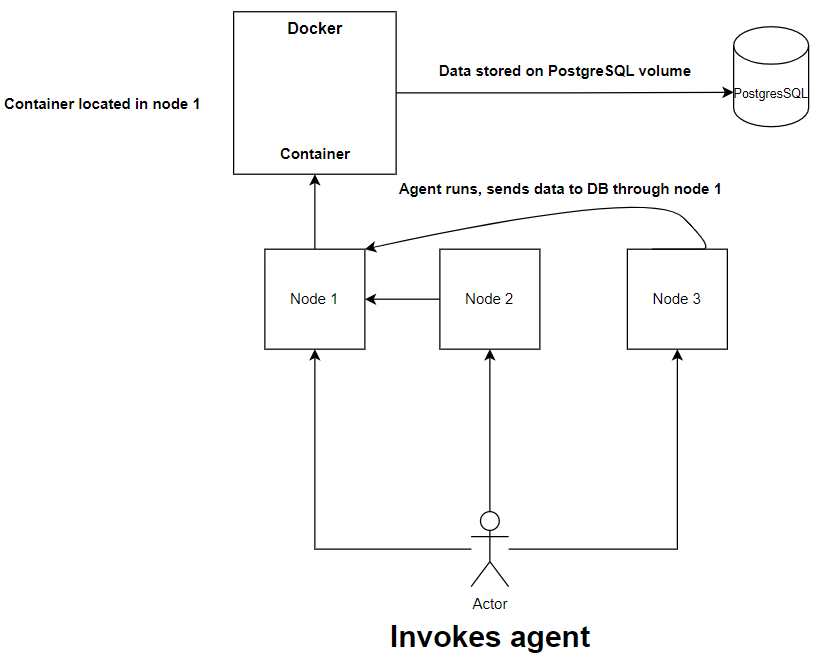

# Linux Cluster Monitoring Agent

# Introduction
The Linux Cluster Monitoring Agent is a tool which allows a user to monitor every node in a Linux cluster. In particular, there are two categories of information which the agent collects and stores: the node's hardware data, and its software usage data. The Agent is written in Bash, and the collected data is stored in a PostgreSQL database on a Docker container. The server usage data is stored persistently (the hardware data is stored once per node). Cron is used to run the server usage script every minute. This allows the user to track the status of every node in the cluster in real time.
# Quick Start
 - ```psql_docker.sh```:
   ```bash 
   linux_sql/scripts/psql_docker.sh "start" "[user]" "[password]" 
   ```
 - ```ddl.sh```:
   ```bash
   psql -h  "[host_name]"-U "[user]"-d "[psql_host]" -f linux_sql/sql/ddl.sql  
   ```
 - ```host_info.sh```:
   ```bash
   bash linux_sql/scripts/host_info.sh "[psql_host]" [psql_port] "[db_name]" "[psql_user]" "[psql_password]"
   ```
 - ```host_usage.sh```:
   ```bash
   bash linux_sql/scripts/host_usage.sh "[psql_host]" [psql_port] "[db_name]" "[psql_user]" "[psql_password]"
   ```
 - ```crontab``` job:  
   ```bash
   crontab -e
   * * * * * bash linux_sql/host_agent/scripts/host_usage.sh "[psql_host]" [psql_port] "[db_name]" "[psql_user]" "[psql_password]" > /tmp/host_usage.log
   ```
# Implementation
   The agent comprises four files and a crontab job. Three are written in Bash, one (```ddl.sql```) is written in SQL, and the crontab job is used to run one Bash script every minute. 
## Architecture
   

We see that the agent scripts are run on every node. The data is then stored in the PostgreSQL database. The Docker container holding the database is located in node 1.
 
## Scripts
  1) ### Database and Docker Initialization
      We must first ensure that the PostgreSQL instance is running, and that the tables which will hold our data have been created. We will do this by starting a Docker container, which the instance will be hosted in. We will use ```psql_docker.sh``` and ```ddl.sql```: 
      ```bash
       # Start the Docker container
       linux_sql/scripts/psql_docker.sh "start" "[user]" "[password]" 
     
       # Create the tables 
       psql -h  "[host_name]"-U "[user]"-d "[psql_host]" -f linux_sql/sql/ddl.sql        
      ```
  2) ### host_info.sh Usage
     This script is to be run only once per node, as hardware specifications are assumed to be static. The hardware specifications are entered into the host_info table in the PostgreSQL instance.
     ```bash
      # Determines the hardware specifications, then enters them into the container
      bash linux_sql/scripts/host_info.sh "[psql_host]" [psql_port] "[db_name]" "[psql_user]" "[psql_password]"
     ```

  3) ### host_usage.sh Usage
       This script will be run every minute, using the ```crontab``` job below. It is used to determine the node's software usage data at the moment of execution.
     ```bash
      # Determines the usage data, then enters them into the container
      bash linux_sql/scripts/host_usage.sh "[psql_host]" [psql_port] "[db_name]" "[psql_user]" "[psql_password]"
     ```  

   4) ### ```crontab``` Setup
        A ```crontab``` job can be used to execute a script at regular intervals. This ```crontab``` job is used to run ```host_usage.sh``` every minute.
        ```bash
      # Allows crontab jobs to be edited
      crontab -e
      # Sets up the job
      * * * * * bash linux_sql/host_agent/scripts/host_usage.sh "[psql_host]" [psql_port] "[db_name]" "[psql_user]" "[psql_password]" > /tmp/host_usage.log
      # Confirm that the job was created
      crontab -ls
      # Check the log file, to confirm the job is working as intended
      cat tmp/host_usage.log
        ```  
      
## Database Modeling
There are two tables: host_info, and host_usage:

# host_info

| Column Name      |   Type    |                                        Meaning |
|------------------|:---------:|-----------------------------------------------:|
| id               |  SERIAL   | Unique node Id, auto-incremented by PostgreSQL |
| hostname         |  VARCHAR  |             Node's Fully Qualified Domain Name |
| cpu_number       |   INT4    |                        Number of logical cores |
| cpu_architecture |   INT2    |                               CPU architecture |
| cpu_model        |   INT2    |                                      CPU Model |
| cpu_mhz          |   INT4    |                                CPU clock speed |
| 12_cache         |   INT4    |                                  L2 Cache size |
| "timestamp"      | TIMESTAMP |              Timestamp, in yyyy-mm-dd UTC time |
| total_mem        |   INT4    |                            Free memory (in kB) |

## host_usage

| Column Name    |   Type    |                                   Meaning |
|----------------|:---------:|------------------------------------------:|
| "timestamp"    | TIMESTAMP |         Timestamp, in yyyy-mm-dd UTC time |
| host_id        |  SERIAL   |             Unique Node ID, same as above |
| memory_free    |   INT4    |                       Free memory (in mB) |
| cpu_idle       |   INT2    | The % of the CPU not currently being used |
| cpu_kernel     |   INT2    | The % of the CPU being used by the kernel |
| disk_io        |   INT4    |          Current number of I/O operations |
| disk_available |   INT4    |   Available memory for the root directory |


# Test

Both ```host_info.sh``` and ```host_usage.sh``` include INSERT statements to add rows into the tables. These were first tested manually by running the scripts in the command line. The PostgreSQL CLI tool was used to ensure that the tables received the data. After the ```crontab``` job was created, the table was checked several times to ensure the data was being received at regular intervals.

# Deployment

The agent uses a ```crontab``` job for automation. The data is stored on a PostgreSQL instance in a Docker container. The agent can be found in the ```linux_sql``` repository on GitHub.

# Improvements

1) The database in the PostgreSQL instance should be backed up. If the Docker container is somehow corrupted or deleted, the information stored on the database will not be lost.
2) If the node's hardware is updated, then the host info table should be updated. ```host_info.sh``` could be run manually after every update, or a ```crontab``` job could be set up, which would run the script every year.
3) An alert could be sent in certain scenarios. For example, if ```host_info.sh``` returns 0 or null for all commands, an alert could be sent to the user. The ```notify-send``` command would be used.
