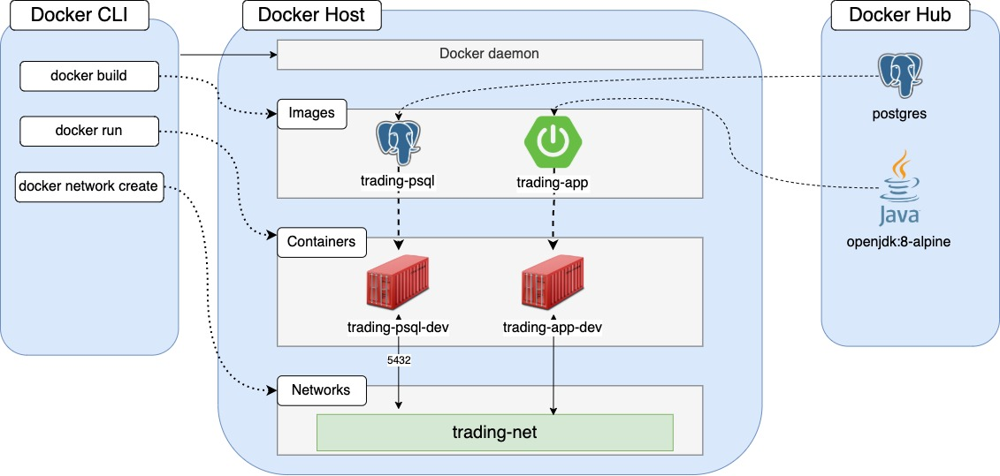

Table of contents
* [Introduction](#Introduction)
* include all first level titles

# Introduction
This application is a stock trading platform. It allows users to create their own stock portfolios without needing real money, creating a real-time simulation of "real" stock portfolios. Users can buy and sell stocks of different corporations. In particular, they can register themselves as a trader, and assemble their own portfolio under their trader ID. The application was written Core Java. SpringBoot is used to store information in a PostgreSQL database. The stock data is obtained in real time from the IEXQuote endpoint, and the application was deployed using Docker.

# Quick Start
For this application to run from Docker, the user must be using CentOS version 7, and must have Docker installed.
The application can be started with the following commands:
```sql
docker run --name trading-psql-dev \
-e POSTGRES_PASSWORD=password \
-e POSTGRES_DB=jrvstrading \
-e POSTGRES_USER=postgres \
--network trading-net \
-d -p 5432:5432 trading-psql
```
```sql
IEX_PUB_TOKEN="your_token"
#start trading-app container which is attached to the trading-net docker network
docker run --name trading-app-dev \
-e "PSQL_URL=jdbc:postgresql://trading-psql-dev:5432/jrvstrading" \
-e "PSQL_USER=postgres" \
-e "PSQL_PASSWORD=password" \
-e "IEX_PUB_TOKEN=${IEX_PUB_TOKEN}" \
--network trading-net \
-p 5000:5000 -t trading-app
```
From here, the application can be tested using Swagger, Postman, or navigating to the relevant URLs in your browser.
# Implemenation
## Architecture

    
- The controller layer is used to handle user requests. It processes user inputs by tracking access to designated endpoints. For example, going to the endpoint quote/all is understood as a request to return all quotes in the database. When the relevant endpoints are reached, the appropriate method in the related service class is called.
   
- The service layer carries out user inputs. In particular, it calls relevant functions in the associated DAO to carry out these operations. Additional functionality is implemented as needed for certain tasks (such as scraping requested quotes from IEX).
 
 - The Data Access Object (DAO) layer interacts with the database. Methods are called here, and interact with their associated database. They may save and update rows in their associated table, among other functionalities.
 - SpringBoot greatly simplifies the process of database interaction. Instead of having to implement methods to manually save or update tables, SpringBoot provides these for us. In addition, we use SpringBoot annotations to mark different layers, which allows the compiler to understand the overall architecture of our application.
 - The IEX endpoint is where we obtain our stock data. Stock quote information is updated in real time, and the user may obtain quote information by its ticker (for example, MSFT for Microsoft). This data is stored in the "quote" table of the PostgreSQL database. PostgreSQL is used as it can interact with object-oriented languages such as Java.

## REST API Usage
### Swagger
Swagger is a set of tools used to develop and maintain RESTful APIs. In the context of this application, it is used to specify our HTTP methods (GET, POST, PUT, DELETE), and our endpoints (which URLs we want to store our data, for example: quote/ticker/{ticker}).
### Quote Controller
The quote controller manages user inputs. In particular, it calls the appropriate service methods and returns their output (where applicable) from the endpoint
- GET `/quote/dailyList`: list all securities that are available to trading in this trading system.
- GET `/quote/quote/all`: return all securities stored in the database.
- PUT `/quote/iexMarketData`: Updates all securities in the database.
- GET `/quote/ticker`: Scrapes the security with the given ticker, and stores it.
- GET `/quote/savedticker`: Scrapes and saves multiple securities.
- GET `/quote/iex/ticker/{ticker}` Scrapes the stock with the given ticker.
### Trader Controller
The trader controller manages a trader's account. In particular, it manages the associated methods, which in turn assure that each transaction is associated with a unique trader.
- POST `/trader/firstname/{firstname}/lastname/{lastname}/dob/{dob}/country/{country}/email/{email}`: creates a trader with the given information.
- DELETE `/trader/traderID/{traderID}`: deletes the trader with the given ID. Only possible if the trader has 0 dollars in their account.
- PUT `/trader/deposit/traderId/{traderId}/amount/{amount}`: Adds an amount of money to a given trader's account.
- PUT `/trader/withdraw/traderId/{traderId}/amount/{amount}`: Removes an amount of money from the trader's account.
### Order Controller
The Order Controller manages orders. In particular, it calls relevant methods based on whether the user wishes to buy or sell a particular stock, and how much of it they want to buy.
- POST `/order/marketOrder`: Manages a user's order, including buying or selling a given amount of stock.
### App Controller
The App Controller creates and runs the application, allowing user's to interact with it. Data is persisted in a PostgreSQL database, allowing users to close the application and return later.


# Test
Every service class was tested. In particular, jUnit was used to create integration tests, which tested every method within these classes.
# Deployment

We create two Docker images for our application. We create a Docker network, which will allow our two containers (one per image) to communicate with each other. This ensures that we can transfer data from one image to another. Docker PSQL is the official Docker image of PostgreSQL.
# Improvements
- I would add a Dashboard controller. This would allow the user to select endpoints from their browser, so they do not need to manually navigate to endpoints.
- I would add more comments to better explain each part of the application.
- I would add some way for the user to check parts of the database. They would be able to see the ID of each trader, for example.
